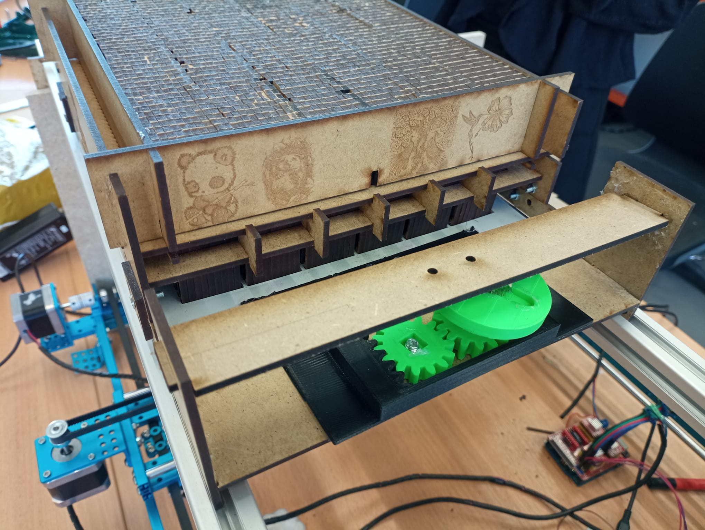
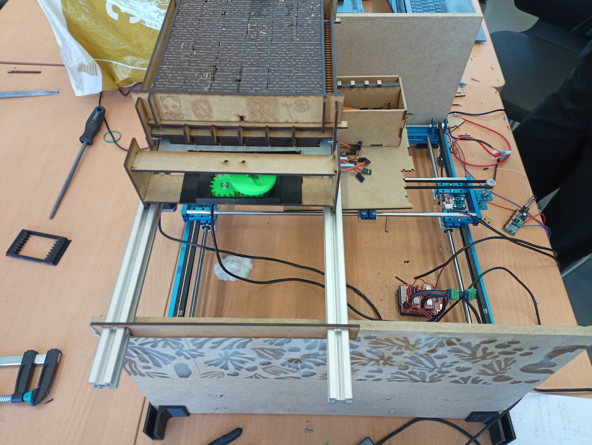

=== Avancement final

De manière générale, notre projet PACT a été bien évolué avec des réalisations remarquables que nous préciserons pour chaque module. Les principaux objectifs que nous nous sommes fixés ont été atteints.

Nous avons réalisé des progrès significatifs dans tous les modules du projet, grâce à notre approche méthodique et l'expertise individuelle de chaque membre de l'équipe. La phase d'integration s'est révélée être un challenge technique très important, et a demandé une collaboration étroite de toute l'équipe. Nous sommes parvenus à faire fonctionner tous les modules ensemble pour la PAN4.

Nous avons finalement un modèle fonctionnel, qui peut être vu dans la photo ci-dessous.

 
 
