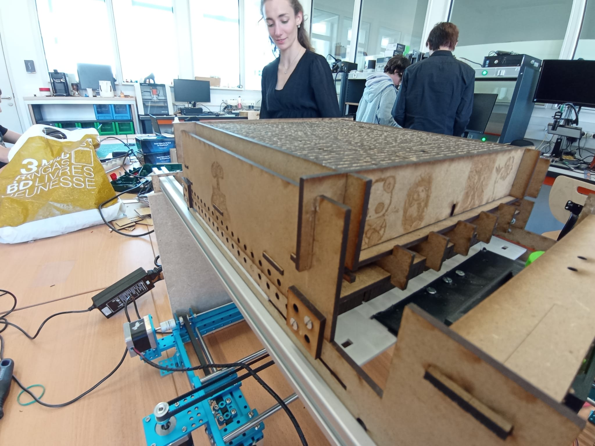

=== Avancement Module Table de picots automatisée

==== Descriptions

*Objectif* : Permettre de modifier un relief de manière automatisée.

//image::../images/exemple-meca.png[Illustration d'un relief changeant]
//_Illustration d'un relief changeant_

*Encadrant* : Mickael Bouhier

==== Cahier des charges

.Cahier des charges
|===
|*Critère* |*Niveau*
|Résolution
|Doit permettre de reconnaître des formes simples.
|Temps de réponse
|A minimiser
|Blocage des picots
|Lorsque les picots sont bloqués, doivent résister à une pression de l'ordre de 5 Newton.
|===

==== Solutions techniques envisagés

*Solution technique envisagée* : Table de picots actionnés par une table XY.

image::../images/pinart.png[ ]

===== Avantages

* facilité de réalisation
* haute résolution
* coût faible

===== Inconvénients

* temps de réponse
* nécessité d'un mécanisme de blocage des picots

==== Avancement
* [*] Trouver un expert.
* [*] Étudier les différentes solutions techniques possibles et en choisir une.
* [*] Effectuer de premiers tests avec une table de picots.
* [*] Évaluer les caractéristiques techniques atteignables pour vérifier la faisabilité du cahier des charges.

* [*] Réaliser un prototype.

* [*] Réalisation du système de blocage et du produit final ( image ci-dessous );

//==== Bibliographie spécifique
