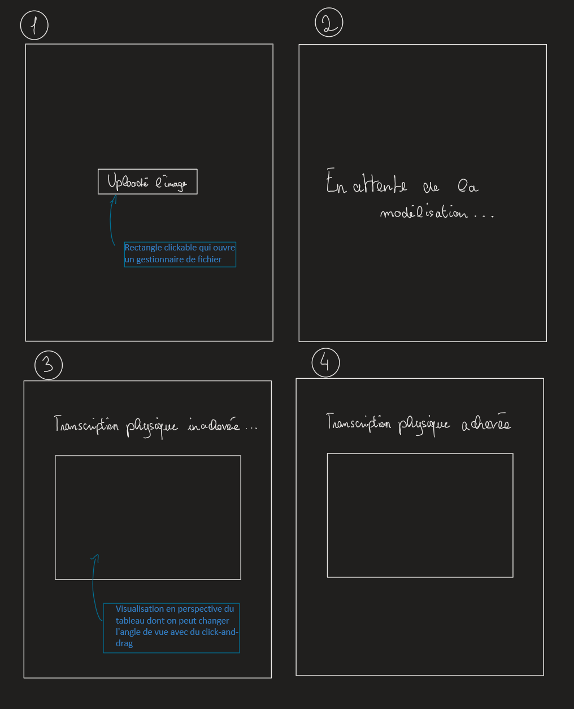

=== Interface utilisateur graphique

Nous avons dessiné les différentes pages du site web.

.Illustration interface web

*(1)* L’utilisateur upload l’image du tableau +
*(2)* Le site web attend que le serveur envoie le modèle 3D +
*(3)* Après réception du modèle +
*(4)* Le site web reçoit la confirmation du serveur que la table de picot est prête +

////
// Il peut y avoir une ou plusieurs interfaces utilisateur (UI en anglais),
ou interface graphique, ou interface homme machine (IHM) : une interface
sur ordinateur et/ou une interface sur mobile ou tablette (Android),
selon le nombre d’appareils en jeu.

// En lien avec un diagramme de séquence, une description simple de chaque
écran/page est nécessaire. Il est recommandé de faire des dessins, même
dessins au crayon, photographiés ou scannés, car ce sont les meilleurs
supports de discussion : on appelle souvent ces dessins un
« storyboard ». Une description textuelle fait le lien entre tous les
éléments de l’IHM (ou des IHMs).
////
//ou interface graphique, ou interface homme machine (IHM) : une interface
//sur ordinateur et/ou une interface sur mobile ou tablette (Android),
// selon le nombre d’appareils en jeu.

// En lien avec un diagramme de séquence, une description simple de chaque
//écran/page est nécessaire. Il est recommandé de faire des dessins, même
//dessins au crayon, photographiés ou scannés, car ce sont les meilleurs
//supports de discussion : on appelle souvent ces dessins un
//« storyboard ». Une description textuelle fait le lien entre tous les
// éléments de l’IHM (ou des IHMs).

L'interface utilisateur se doit d'être très simple pour notre projet, puisque les utilisateurs sont potentiellement des malvoyants. Une simple page web, avec un bouton pour envoyer une image, est suffisante.
La prévisualisation du modèle est un ajout possible intéressant puisqu’il permet d’entamer un premier dialogue avant de toucher l’oeuvre mais également de comparer le modèle avec la réalité physique de la table de picot.

