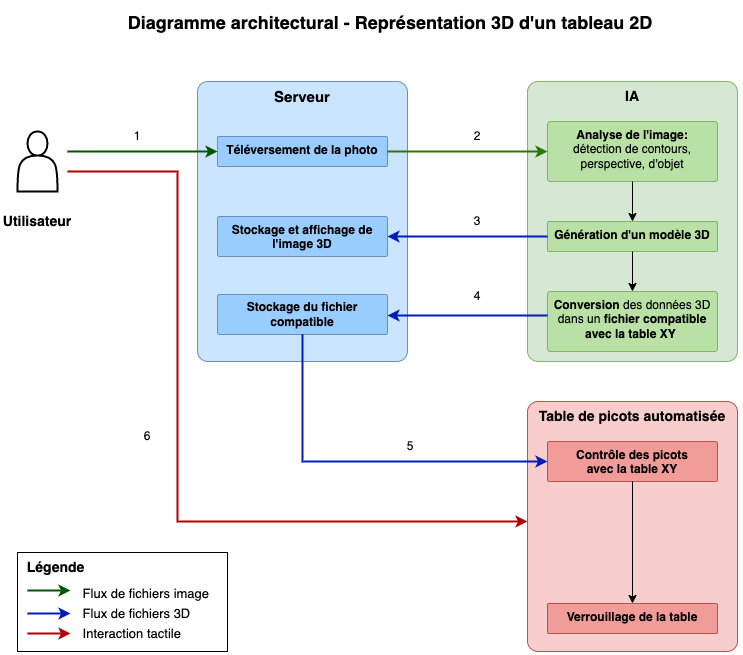

=== Schéma d’architecture
Nous avons conçu un diagramme architectural dans lequel nous découpons notre projet en 3 blocs principaux.

.Diagramme architectural

Nous avons ajouté des étapes numérotées pour une meilleure compréhension du diagramme. Ces étapes seront décrites plus précisément dans le diagramme de séquence.

=== Description des blocs et des modules

Nous avons divisé notre projet en 3 grands blocs et nous avons 7 modules différents.

==== Bloc **Serveur**
Le bloc **Serveur** compte un seul module appelé **Communication Client Serveur** sur la plateforme PACT.
En réalité, il regroupe l’implémentation d’un serveur et d’un site web. 
Le site web permet à nos utilisateurs d’uploader l’image du tableau qu’ils ont choisie d’être transcrite. Elle permet également de visualiser la modélisation en 3D de l'œuvre que nous allons représenter sur notre table à picots. 
Le serveur se charge de stocker les données qu’il reçoit et de les renvoyer aux bonnes entités. Il a 3 clients dont il reçoit des données. Il y a l'interface web qui envoie l’image du tableau, l’ordinateur qui envoie la transcription du tableau en un modèle 3D, ainsi que la table de picot qui reçoit le fichier compatible pour actionner sa table XY et qui confirme qu’elle est prête. À la réception du tableau, le serveur envoie l’image à l’ordinateur. À la réception du modèle 3D produite par l’ordinateur, le serveur l’envoie à l'interface web et envoie le fichier compatible qu'à la table de picot automatisée.
Finalement, lorsque la table de picot confirme qu’elle est prête, le serveur envoie cette information au site web pour qu’il puisse l’indiquer à l'utilisateur. 

==== Bloc **IA**
Le bloc **IA** compte deux modules appelés **Traitement d'image** et **Conception 3D** sur la plateforme PACT.
Le module **Traitement d'image** a pour but d'analyser le tableau à l'aide d'algorithmes de traitement d'image et de réseaux de neurones.
Après un premier échange avec notre expert, nous avons choisi d'utiliser à la fois de la segmentation sémantique et de la détection de contours dans la chaîne de valeur partant de la photo 2D du tableau à l’information pertinente.
La segmentation sémantique permettra de définir sur une image plusieurs ensembles de points relatifs à des objets, et ainsi de détacher les objets (importants pour la compréhension de l'œuvre) du fond. La détection de contours apportera une analyse plus fine du tableau, en repérant les pixels où nous avons un changement brutal de l'intensité lumineuse.
À partir de l'information pertinente, le module **Conception 3D** a pour but de construire un modèle 3D de l'œuvre artistique. Nous allons créer deux types de modèle 3D : un fichier destiné à être affiché sur le site web et un fichier compatible pour l'actionnement de la table XY. 

==== Bloc **Table de picots automatisée**
Le bloc **Table de picots automatisée** compte deux modules appelés **Systèmes embarqués** et **Autre - Mécanique** sur la plateforme PACT.
L’objectif va être de créer/récuperer une table de picots, puis d’actionner grâce à une table XY munie d’un ou plusieurs actionneurs de type piston chaque picot (ou groupe de picots) successivement. Pour que chaque picot ne retombe pas une fois positionné, la table de picots devra être mise en position verticale, face à l’utilisateur. Une fois la mise en place des picots terminée, il ne restera plus qu’à bloquer l’ensemble des picots grâce à un mécanisme d’adhérence.

==== _Hors bloc_

===== Module **Intégration et tests**
Notre objectif à travers ce module est de mettre en cohérence les autres modules à travers des contrôles de compatibilité entre les résultats attendus et les résultats reçus par chaque module vis à vis des autres. Nous procéderons à des tests à l’issue du traitement d’image pour s’assurer que tous les points clé et contours de l’image ont été reconnus par l’algorithme. Ensuite, nous vérifierons que la modélisation 3D représente bien le tableau de base. Nous nous assurerons que la modélisation 3D fourni des données utiles et compatible à la table XY pour la représentation sur la table de picots. Finalement, nous vérifierons que la résolution de la représentation sur la table de picots et le temps d’exécution de tout le mécanisme soient optimales.

===== Module **SES - Cognition**

Notre projet a pour but de répondre à un besoin social, celui de l’ intégration d’une partie de la société, celle souffrant d’un handicap visuel. En facilitant sa visite dans les musées, il lui permet l’accès à notre patrimoine culturel. Le module SES a pour but, en plus d’identifier ce besoin, de cerner ses limites, de définir les aspects qui permettraient de valider ou non notre produit final et de le tester.
Il sera question de rencontrer des associations de personnes souffrant de déficiences visuelles, de fabricants de matériel spécialisé dans le handicap visuel et de professionnels de santé (psychologue spécialisé dans le handicap visuel notamment) comme nous avons déjà pu le faire lors des interviews menées au début du projet PACT, mais aussi d’entrer en contact avec des musées, hypothétiques clients.
Il s’agira également de mettre au point un test de validation faisant appel à des groupes de personnes déficientes visuelles ou non pour conclure quant à la pertinence de notre produit fini.   
Un des objectifs fondamentaux de ce module est de jouer le rôle d’intermédiaire entre les clients, les non-voyants, les musées (qui ont des attentes diverses) et les concepteurs.
Ce module est le fil rouge de tous les autres modules et plus particulièrement du module traitement d’images. En effet, l’un des principaux enjeux dans notre travail est la retranscription de l’œuvre artistique, résultat d’interprétations et de choix de notre part, c’est-à-dire la traduction d’une œuvre picturale avec ses couleurs, personnages, effets de perspective, symboles, les émotions qu’elle procure en des hauteurs de picots, des variations de température et du son émis. C’est une entreprise complexe puisqu’elle demande une compréhension de la manière dont les non-voyants conçoivent chacune des composantes du tableau comme les couleurs, les concepts et la recherche d’une symbolique haptique et auditive qui puisse permettre de les retranscrire. C’est d’ailleurs la raison pour laquelle nous avons décidé de faire appel à un expert en cognition pour ce module.
Enfin, dans le contexte de changement climatique, la considération du coût carbone de notre projet s’impose. Les sources principales de notre projet sont la complexité algorithmique, l’alimentation des différents éléments et l’importation des composants nécessaires à la confection de notre appareil. Il s’agira de les évaluer puis de les réduire au maximum pour s’inscrire dans une démarche sociale respectueuse de l’environnement.

