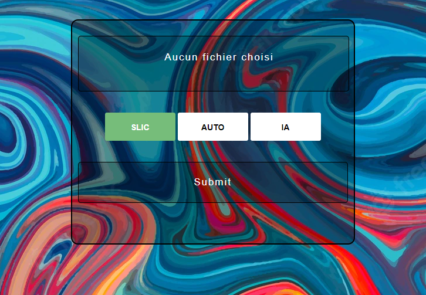
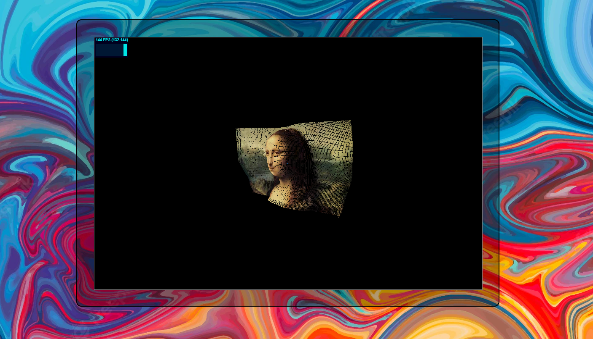

=== Serveur et interface

==== Client Serveur

Il y a en réalité deux serveurs. Le serveur principal qui gère la communication avec le site web. Et le serveur de l’arduino qui n’a qu’un rôle, attendre la requête HTML du serveur principal contenant un fichier texte pour démarrer la mise en place des picots.

Après l'upload sur le serveur de l'image proposé par l'utilisateur, le serveur principal traite celle-ci pour la modélisation 3D et envoie une première requête HTML pour vérifier que l'arduino est bien sur le même réseau. Après la modélisation, si l'arduino est connecté au réseau, le serveur principal envoie le fichier texte à l'arduino. Il enverra également un fichier ply au site web pour la modélisation 3D.

L'intérêt d'avoir deux serveurs est pour l'arduino de ne pas devoir envoyer de manière cyclique un message au serveur principal pour lui demander s'il peut lui envoyer un fichier texte. Cela permet de ne pas surcharger le réseau

==== Interface graphique : Site web

Le site web est très simple d'utilisation. L'utilisateur peut sélectionner une image en cliquant sur le premier bouton. Il a ensuite 3 modes de modélisation 3D qu'il peut choisir : SLIC, AUTO, et IA. Il peut ensuite upload l'image et une page d'attente s'affichera.

.Interface Web acceuil
 

Une fois la modélisation produite par le serveur, elle est renvoyée au site web et l'utilisateur pourra la visualiser directement et modifier les angles de vue, zoomer et dézoomer à l'aide de sa souris.

.Interface Web modèle 3D  
 

//fin interface

