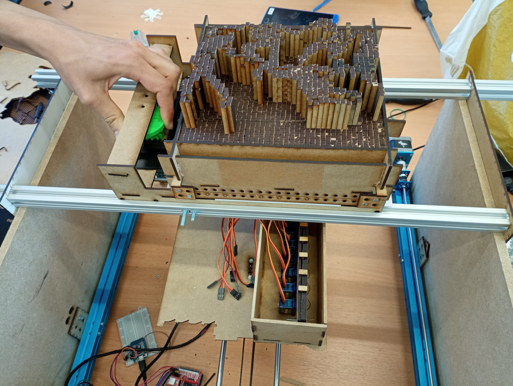

=== Documentation Vérouillage table de picots

Le vérouillage comporte deux modes : 

mode bloqué (la plaque est tirée vers l'arrière);
mode libre (les picots retombent);

Le blocage s'effectue car les picots possèdent des crans représentés ci-dessous.

image::../images/ww.jpeg

Le moteur est actionné via une carte arduino.

 
