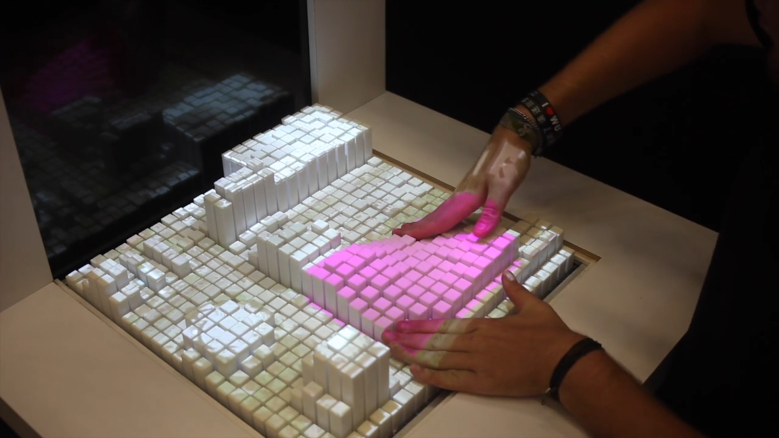

=== Description de l’état de l’art
ifdef::env-gitlab,env-browser[:outfilesuffix: .adoc]

La modélisation 3D à partir d’une image 2D est un problème complexe qui est encore loin de fonctionner. L’une des méthodes utilisée est de prendre plusieurs photos d’un même objet sous différents angles pour pouvoir ensuite les compiler ensemble. Cependant, dans le cas d’une peinture, cette méthode n’est pas utilisable. Il existe de nombreuses modélisations 3D de peinture célèbre, mais elles ne sont pas créées de manière automatique comme nous souhaiterions le faire. Notamment, la photo de la Joconde en introduction est une création de ce type précisément destinée aux personnes aveugles. Elle a été faite par une start-up qui se nomme Unseen Art. <<c>>

Aluna Everitt a publié une thèse à l'université d'Oxford nommée "Digital Fabrication Approaches for the Design and Development of Shape-Changing Displays". C'est une thèse de plus de 200 pages qui est un état de l'art complet sur les différentes conceptions numériques possible pour le développement d'affichage à changement de forme.  <<a>>

Des chercheurs du MIT ont créé un prototype comme Proof of concept qui est une représentation physique de surface en perspective à partir de données numériques. Ce prototype nommé Materiable réalise tout ce qui nous permettrait de représenter notre peinture en 3D. C’est une surface rectangulaire composée de pavé droit qui ressortent plus ou moins de la surface. De plus, chaque pavé modifie sa hauteur de manière instantanée ce qui permet d’ajouter du mouvement à la surface et donc de représenter des objets en mouvements mais également de produire des sensations haptiques au toucher. <<b>>

.Image d'illustration : projet Materiable <<b>>

