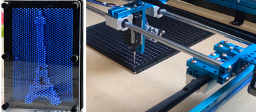

=== Description de la proposition
// *_Note: 2 page max._*

L’art a traditionnellement été conçu comme appartenant exclusivement au domaine visuel. Cette prise de conscience au cours de ces dernières décennies a conduit à la mise en place de stratégies pour que les œuvres d’art deviennent accessibles à l’appréciation des personnes sans vision. Cependant, malgré la démarche empirique des musées, l’inclusion des déficients visuels dans ces espaces reste partielle.
Notre objectif est alors de transcrire au travers d’une expérience sensorielle des œuvres d’art picturales. 
Le musée étant un espace de partage, nous cherchons à éveiller la curiosité de tous les publics, et pas uniquement des déficients visuels pour une inclusion effective. Nous avons comme motivation principale de participer à l'inclusion des déficients visuels dans les musées. 
Plus précisément, nous avons pour but de réaliser une représentation en trois dimensions qui fasse appel au toucher, à l’ouïe pour rendre compte d'un tableau. Le rendu matériel final est une table de picots mobiles dont la montée et descente permet de rendre compte de volumes, contours du tableau. Cette table est mobile en ce qu'elle change de forme en fonction de l'œuvre choisie.
Face à un tableau dans un musée, le déficient visuel en possession de notre produit pourra sélectionner l'œuvre devant laquelle il se trouve dans une bibliothèque de tableaux disponibles. À cela, nous ajouterons des hauts-parleurs pour une description adaptée de l'œuvre. Nous avons pour ambitions également de rendre compte des couleurs en ajoutant une nappe chauffante (réseau de résistances), c'est-à-dire établir une correspondance entre couleur et chaleur. Cette idée reste pour l'instant secondaire ; nous la considérerons s'il nous reste du temps avant la fin de notre projet.
Il n’y a pas de principes qui indiqueraient la façon dont rendre accessibles aux autres sens que la vue les œuvres d’art. Il s'agit d'un des premiers problèmes qu'il nous faut résoudre. Au-delà de ce souci de traduction, nous allons devoir faire face à des difficultés d'ordre technique : le traitement numérique du tableau, sachant qu'il existe des traitements figuratifs très diverses du fait des nombreux mouvements en peinture, et le passage de ce traitement à des mouvements physiques. Enfin, le mouvement des picots soulève beaucoup de questions avant même l'élaboration du projet. Il est difficile d'allier résolution et faisabilité. En effet, une bonne résolution signifie un grand nombre de picots, mais un grand nombre de picots implique un temps d'exécution élevé et un agencement des picots difficiles. Il s'agira pour nous de trouver un compromis (nombre de picots et choix de la méthode).

.Image d'illustration : Table de Picots actionnée par une table XY<<c>>

Notre objectif n'est pas d'être le plus exhaustif possible en terme de détails, rendu des couleurs. Bien que notre projet ait pour but de retranscrire une œuvre déjà existante pour la rendre accessible à des personnes mal-voyantes, notre produit sortant est une nouvelle "œuvre" et ne peut prétendre être exhaustive, être une “traduction”. En effet, notre produit est le fruit de plusieurs interprétations, décisions du groupe à différents stade de sa création. De plus, notre projet ne se limite pas à représenter une œuvre existante mais à créer une expérience sensorielle. Elle requiert des ajouts de notre part qui sont à voir comme des choix artistiques. Nous aimerions re-créer une ambiance. En cela notre œuvre n'est pas exclusivement réservée aux mal-voyants, elle s’adresse à tous et permet un partage qui est essentiel dans l’art.

